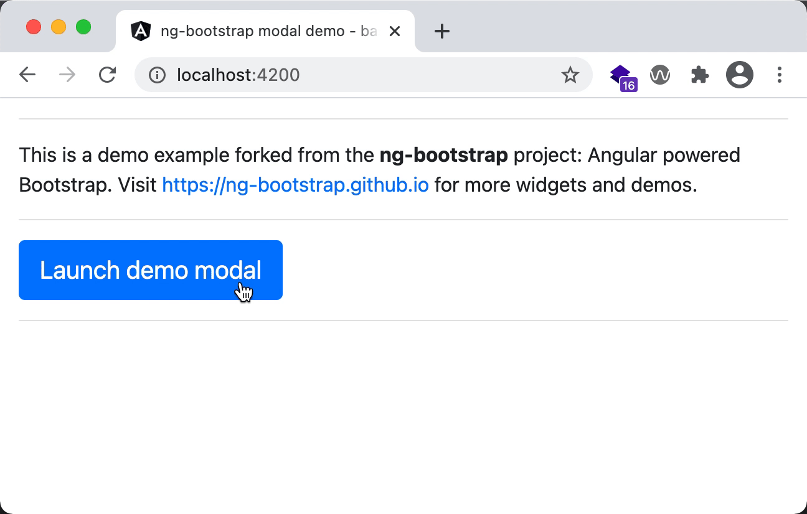
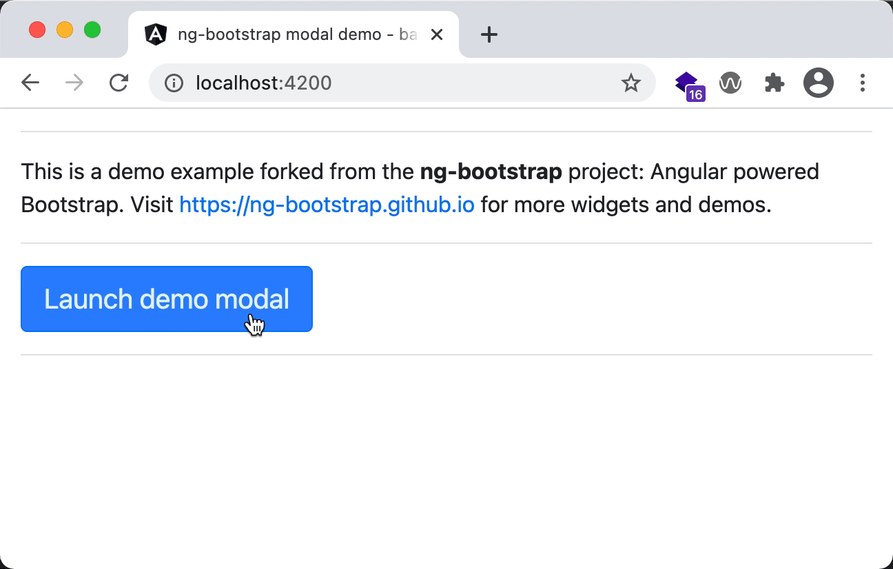

# ng-bootstrap-modal-example

This is an example Angular 11 app to reproduce unexpected behavior where NG Bootstrap's modal entry animation
(downwards movement) is missing  when running the production build:



The animation works as expected when running the development server:



## Production build (to reproduce the problem)

Build and start the HTTP server:
```sh
npm run start:prod
```

Then go to http://localhost:4200/.

## Development server (for comparison)

Build and start the development server:
```sh
npm start
```

Then go to http://localhost:4200/.
